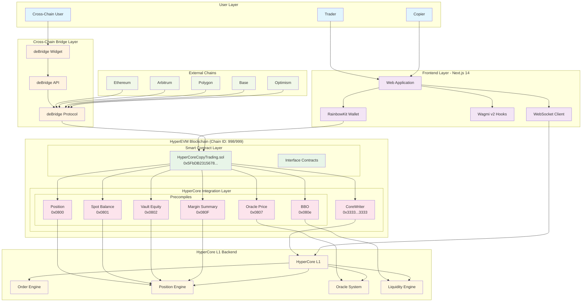
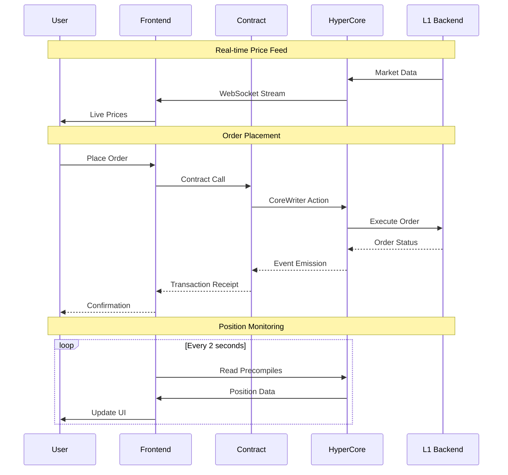
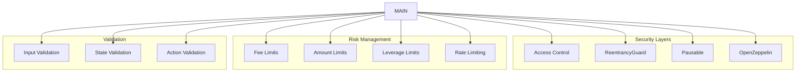

# HyperMirror System Architecture

## High-Level System Overview

## Component Details

### Frontend Application (Next.js 14)
- **Web Application**: Main user interface for traders and copiers
- **RainbowKit**: Wallet connection and management
- **Wagmi v2**: Ethereum interaction hooks and utilities
- **WebSocket Client**: Real-time data streaming from HyperCore

### Smart Contract Layer
- **HyperCoreCopyTrading.sol**: Main copy trading contract deployed at `0x5FbDB2315678afecb367f032d93F642f64180aa3`
- **Interface Contracts**: IL1Read.sol and ICoreWriter.sol for HyperCore integration

### HyperCore Integration
- **CoreWriter (0x3333...3333)**: Gateway for sending actions to HyperCore L1
- **Precompiles**: Direct access to HyperCore state and functionality

### Cross-Chain Infrastructure
- **deBridge Protocol**: Decentralized cross-chain bridging
- **deBridge Widget**: Embedded UI for seamless bridging experience
- **Multi-Chain Support**: Ethereum, Arbitrum, Polygon, Base, Optimism

## Data Flow Architecture

## Network Configuration

### HyperEVM Networks
- **Testnet**: Chain ID 998, RPC: `https://rpc.hyperliquid-testnet.xyz/evm`
- **Mainnet**: Chain ID 999, RPC: `https://rpc.hyperliquid.xyz/evm`

### Supported External Chains
- Ethereum (Chain ID: 1)
- Arbitrum One (Chain ID: 42161)
- Polygon (Chain ID: 137)
- Base (Chain ID: 8453)
- Optimism (Chain ID: 10)

## Security Architecture

## Performance Considerations

### Real-time Updates
- **Position Monitoring**: 2-second intervals
- **Price Feeds**: 1-second intervals
- **Order Book**: 500ms intervals
- **WebSocket**: Sub-second latency

### Scalability Features
- **Gas Optimization**: Batch operations where possible
- **State Management**: Efficient storage patterns
- **Event Indexing**: Optimized for quick queries
- **Caching Strategy**: Frontend data caching for improved UX