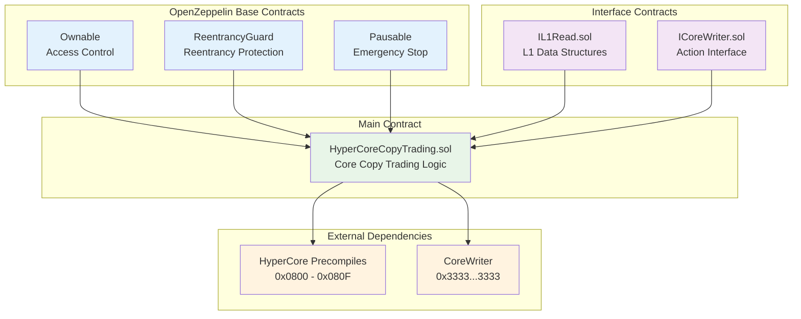
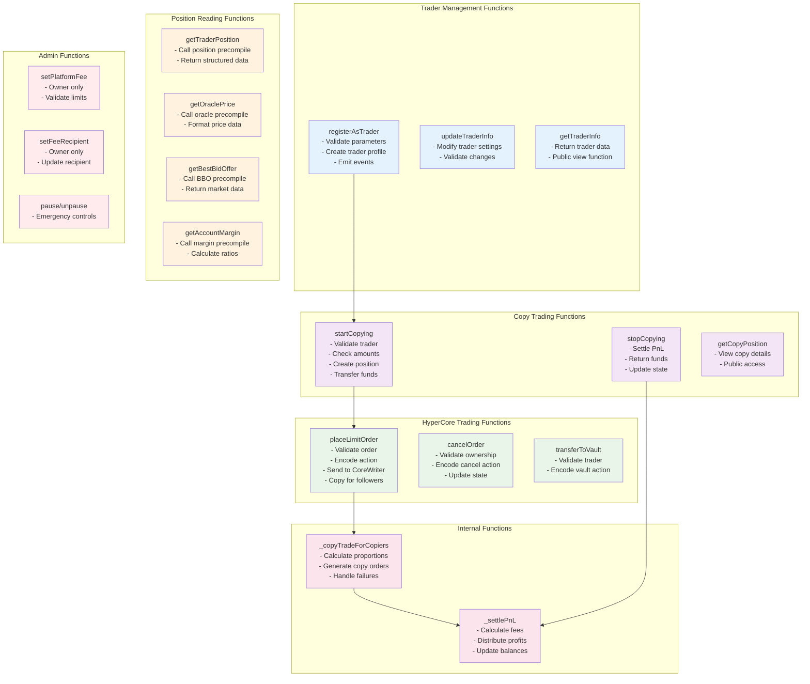
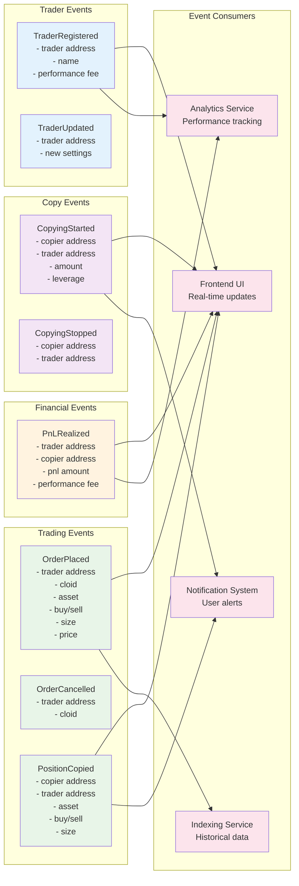
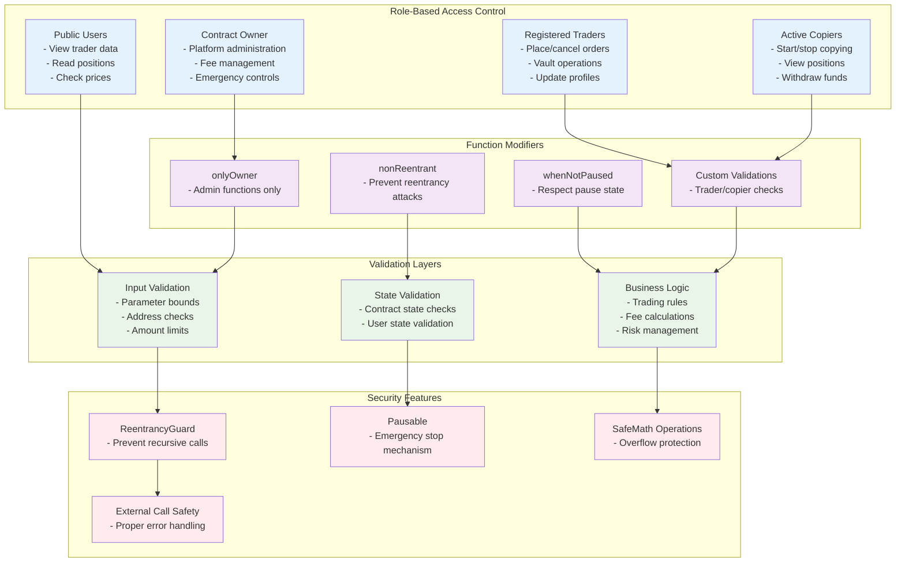
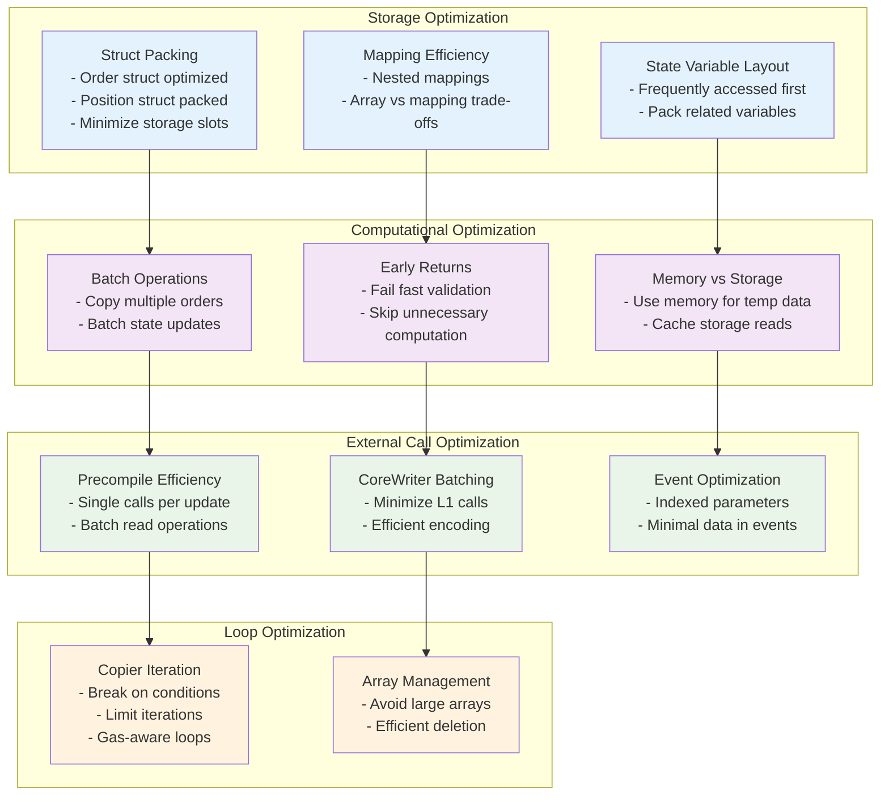
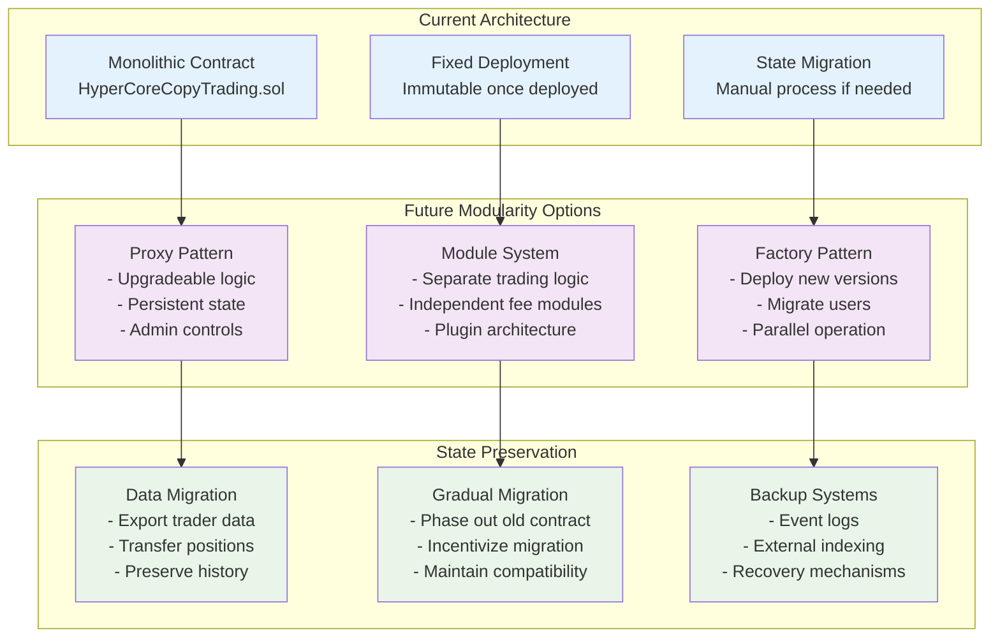
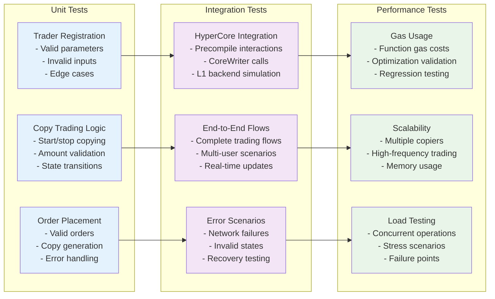

# Smart Contract Architecture

## Contract Hierarchy and Relationships



## Contract State Variables Architecture

```mermaid
graph TD
    subgraph "Core Data Structures"
        DS1[Trader Struct<br/>- isActive: bool<br/>- name: string<br/>- bio: string<br/>- performanceFee: uint256<br/>- minCopyAmount: uint256<br/>- maxCopyAmount: uint256<br/>- totalCopiers: uint256<br/>- totalVolume: uint256<br/>- totalPnL: int256<br/>- copiers: mapping<br/>- copierList: address[]<br/>- lastTradeTimestamp: uint256]

        DS2[CopyPosition Struct<br/>- isActive: bool<br/>- allocatedAmount: uint256<br/>- leverage: uint256<br/>- copyPerps: bool<br/>- copySpot: bool<br/>- unrealizedPnL: int256<br/>- copiedSince: uint256]

        DS3[Order Struct<br/>- asset: uint32<br/>- isBuy: bool<br/>- limitPx: uint64<br/>- size: uint64<br/>- reduceOnly: bool<br/>- tif: uint8<br/>- cloid: uint128<br/>- trader: address<br/>- timestamp: uint256]
    end

    subgraph "State Mappings"
        SM1[traders<br/>mapping(address => Trader)]
        SM2[orders<br/>mapping(uint128 => Order)]
        SM3[lastKnownPositions<br/>mapping(address => mapping(uint32 => Position))]
    end

    subgraph "Global State"
        GS1[allTraders: address[]]
        GS2[nextCloid: uint128]
        GS3[platformFee: uint256]
        GS4[feeRecipient: address]
    end

    %% Relationships
    DS1 --> SM1
    DS2 --> SM1
    DS3 --> SM2
    SM1 --> GS1
    SM2 --> GS2

    %% Styling
    classDef dataStruct fill:#e3f2fd
    classDef stateMapping fill:#f3e5f5
    classDef globalState fill:#e8f5e8

    class DS1,DS2,DS3 dataStruct
    class SM1,SM2,SM3 stateMapping
    class GS1,GS2,GS3,GS4 globalState
```

## Function Architecture by Category



## Event Architecture and Flow



## Access Control and Security Model



## Gas Optimization Patterns



## Error Handling Strategy

```mermaid
graph TD
    subgraph "Error Categories"
        EC1[Input Errors<br/>- Invalid parameters<br/>- Out of bounds values<br/>- Malformed data]
        EC2[State Errors<br/>- Unauthorized access<br/>- Invalid state transitions<br/>- Insufficient funds]
        EC3[External Errors<br/>- Precompile failures<br/>- CoreWriter errors<br/>- Network issues]
        EC4[Business Logic Errors<br/>- Trading rule violations<br/>- Risk limit breaches<br/>- Fee calculation errors]
    end

    subgraph "Error Handling Mechanisms"
        EH1[require() Statements<br/>- Immediate validation<br/>- Clear error messages<br/>- Gas efficient]
        EH2[try/catch Blocks<br/>- External call safety<br/>- Graceful degradation]
        EH3[Custom Errors<br/>- Gas efficient errors<br/>- Structured error data]
        EH4[Event Logging<br/>- Error event emission<br/>- Debug information]
    end

    subgraph "Recovery Strategies"
        RS1[State Rollback<br/>- Atomic operations<br/>- Consistent state]
        RS2[Partial Execution<br/>- Continue on failures<br/>- Batch operation safety]
        RS3[Circuit Breakers<br/>- Pause functionality<br/>- Emergency stops]
        RS4[User Notification<br/>- Clear error messages<br/>- Action guidance]
    end

    %% Error flow
    EC1 --> EH1
    EC2 --> EH1
    EC3 --> EH2
    EC4 --> EH3

    EH1 --> RS1
    EH2 --> RS2
    EH3 --> RS3
    EH4 --> RS4

    %% Styling
    classDef errorCategory fill:#ffebee
    classDef errorHandling fill:#fff3e0
    classDef recovery fill:#e8f5e8

    class EC1,EC2,EC3,EC4 errorCategory
    class EH1,EH2,EH3,EH4 errorHandling
    class RS1,RS2,RS3,RS4 recovery
```

## Upgrade Strategy and Modularity



## Integration Testing Architecture



This comprehensive contract architecture provides a robust, secure, and efficient foundation for the HyperMirror copy trading platform while maintaining clear separation of concerns and scalability for future enhancements.