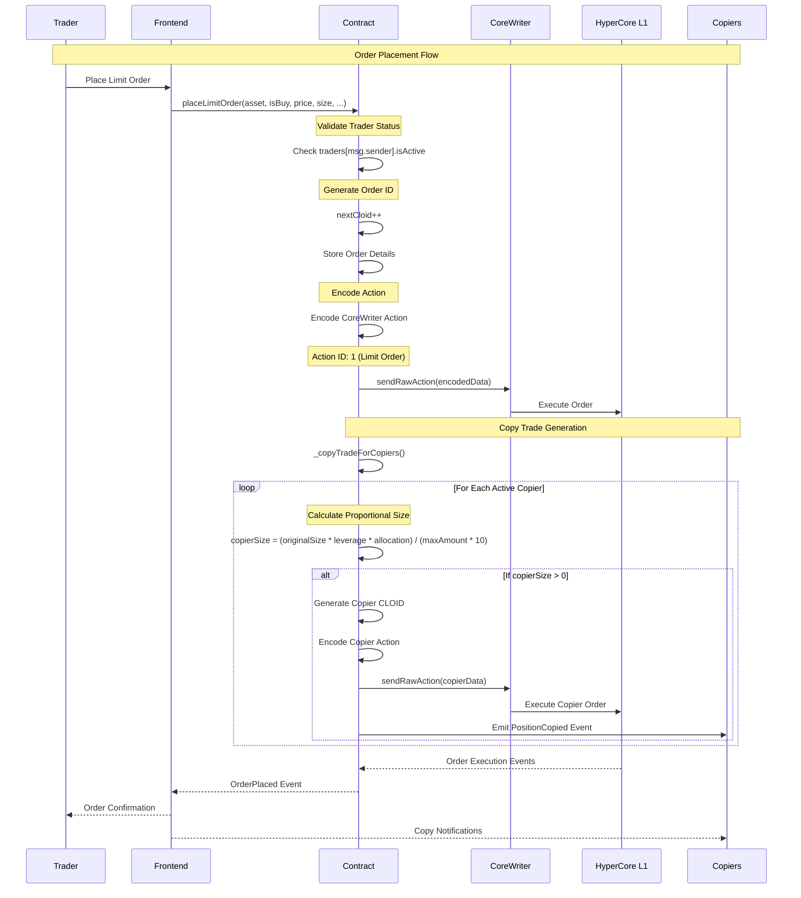
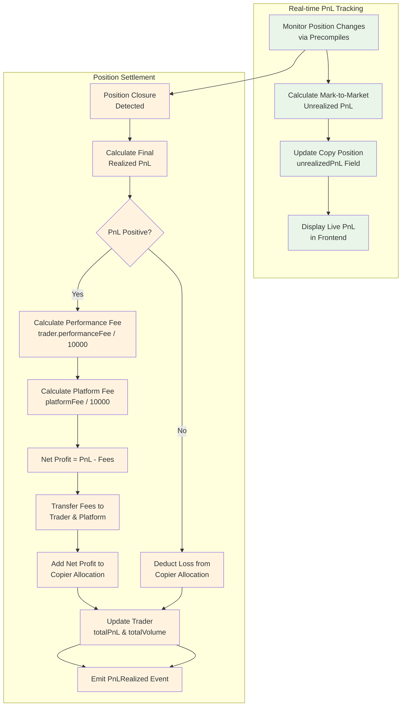
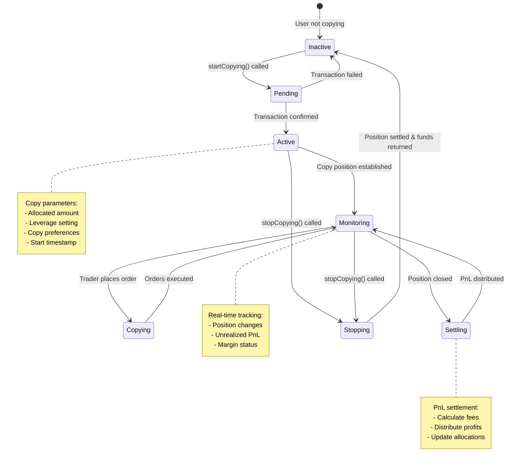

# Copy Trading Flow Diagram

## Complete Copy Trading Workflow

```mermaid
graph TD
    subgraph "Trader Registration Flow"
        T1[Trader Decides to<br/>Share Strategy]
        T2[Fill Registration Form<br/>Name, Bio, Fee Structure]
        T3[Set Parameters<br/>Min/Max Copy Amount<br/>Performance Fee ≤ 50%]
        T4[Submit Registration<br/>Transaction]
        T5[Trader Profile Created<br/>Listed on Platform]
    end

    subgraph "Copier Onboarding Flow"
        C1[User Browses<br/>Trader Leaderboard]
        C2[Reviews Trader Stats<br/>PnL, Volume, Copiers]
        C3[Selects Copy Amount<br/>Leverage Settings]
        C4[Chooses Copy Options<br/>Perps, Spot, or Both]
        C5[Confirms Copy<br/>Transaction + Deposit]
        C6[Copy Position Active<br/>Monitoring Begins]
    end

    subgraph "Order Placement & Mirroring"
        O1[Trader Places Order<br/>Via Platform Interface]
        O2[Contract Validates<br/>Order Parameters]
        O3[Encode Action for<br/>CoreWriter]
        O4[Send to HyperCore L1<br/>Order Engine]
        O5[Order Executed<br/>on HyperCore]
        O6[Copy Order Generation<br/>for All Active Copiers]
        O7[Proportional Size<br/>Calculation]
        O8[Copier Orders<br/>Submitted to L1]
    end

    subgraph "Position Tracking & PnL"
        P1[Position Changes<br/>Detected via Precompiles]
        P2[Calculate Unrealized<br/>PnL for Each Position]
        P3[Update Copy Position<br/>State in Contract]
        P4[Real-time PnL<br/>Display in UI]
        P5[Position Close<br/>Trigger Event]
        P6[Settle Realized PnL<br/>Distribute Fees]
    end

    subgraph "Fee Distribution"
        F1[Calculate Profits<br/>from Closed Positions]
        F2[Deduct Performance Fee<br/>to Trader]
        F3[Deduct Platform Fee<br/>1% Default]
        F4[Transfer Net Profit<br/>to Copier]
        F5[Update Trader Stats<br/>Total Volume & PnL]
    end

    %% Flow connections
    T1 --> T2 --> T3 --> T4 --> T5
    C1 --> C2 --> C3 --> C4 --> C5 --> C6
    O1 --> O2 --> O3 --> O4 --> O5 --> O6 --> O7 --> O8
    P1 --> P2 --> P3 --> P4 --> P5 --> P6
    F1 --> F2 --> F3 --> F4 --> F5

    %% Cross-flow connections
    T5 --> C1
    C6 --> O6
    O8 --> P1
    P6 --> F1

    %% Styling
    classDef traderFlow fill:#e3f2fd
    classDef copierFlow fill:#f3e5f5
    classDef orderFlow fill:#e8f5e8
    classDef trackingFlow fill:#fff3e0
    classDef feeFlow fill:#fce4ec

    class T1,T2,T3,T4,T5 traderFlow
    class C1,C2,C3,C4,C5,C6 copierFlow
    class O1,O2,O3,O4,O5,O6,O7,O8 orderFlow
    class P1,P2,P3,P4,P5,P6 trackingFlow
    class F1,F2,F3,F4,F5 feeFlow
```

## Detailed Order Mirroring Process

## PnL Calculation and Settlement

## Risk Management Flow

```mermaid
graph TD
    subgraph "Pre-Trade Validation"
        V1[Check Trader Active Status]
        V2[Validate Copy Amount<br/>Min ≤ Amount ≤ Max]
        V3[Validate Leverage<br/>1x ≤ Leverage ≤ 50x]
        V4[Check Copy Settings<br/>Must Copy Perps or Spot]
        V5[Verify Not Already<br/>Copying This Trader]
    end

    subgraph "Order Validation"
        O1[Validate Asset Index]
        O2[Check TIF Parameter<br/>1=ALO, 2=GTC, 3=IOC]
        O3[Validate Price & Size<br/>Within Market Limits]
        O4[Check Reduce Only Flag]
    end

    subgraph "Position Risk Management"
        P1[Monitor Margin Ratio<br/>via Margin Summary]
        P2[Calculate Total<br/>Position Exposure]
        P3[Check Maximum<br/>Allocation Limits]
        P4[Monitor Leverage<br/>Across All Positions]
        P5[Auto-liquidation<br/>Protection]
    end

    subgraph "Fee Protection"
        F1[Validate Performance Fee<br/>≤ 50% Maximum]
        F2[Validate Platform Fee<br/>≤ 5% Maximum]
        F3[Prevent Fee<br/>Manipulation]
    end

    %% Flow connections
    V1 --> V2 --> V3 --> V4 --> V5
    O1 --> O2 --> O3 --> O4
    P1 --> P2 --> P3 --> P4 --> P5
    F1 --> F2 --> F3

    %% Styling
    classDef validation fill:#ffebee
    classDef orderCheck fill:#e8eaf6
    classDef riskMgmt fill:#fff3e0
    classDef feeProtection fill:#e0f2f1

    class V1,V2,V3,V4,V5 validation
    class O1,O2,O3,O4 orderCheck
    class P1,P2,P3,P4,P5 riskMgmt
    class F1,F2,F3 feeProtection
```

## Copy Trading States and Transitions

## Key Metrics and KPIs

### Trader Metrics
- **Total Copiers**: Number of active copiers
- **Total Volume**: Cumulative trading volume
- **Total PnL**: Lifetime profit/loss
- **Performance Fee**: Fee percentage (0-50%)
- **Win Rate**: Percentage of profitable trades
- **Sharpe Ratio**: Risk-adjusted returns
- **Maximum Drawdown**: Largest peak-to-trough loss

### Copier Metrics
- **Allocated Amount**: ETH deposited for copying
- **Leverage**: Position size multiplier
- **Unrealized PnL**: Current position profit/loss
- **Copy Duration**: Time since starting to copy
- **Copy Settings**: Perps/Spot preferences
- **ROI**: Return on investment percentage

### Platform Metrics
- **Total Value Locked (TVL)**: Sum of all allocated amounts
- **Active Traders**: Number of registered traders
- **Active Copiers**: Number of active copy positions
- **Platform Fees Collected**: Total fee revenue
- **Trading Volume**: Total platform trading volume
- **User Growth**: New user acquisition rate