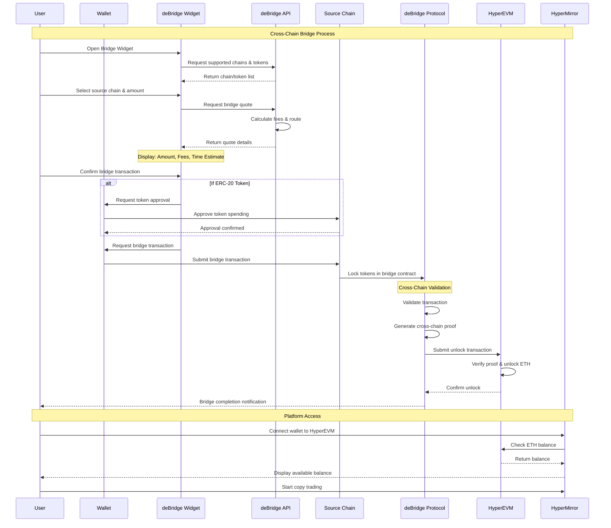
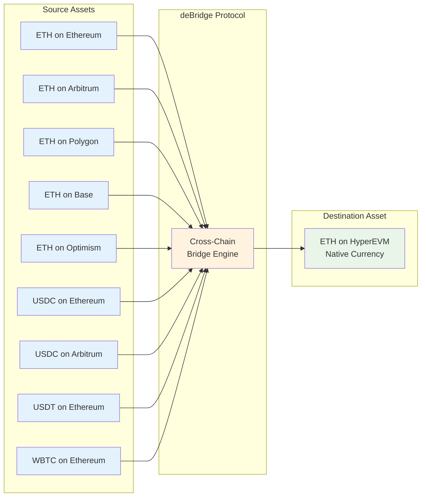
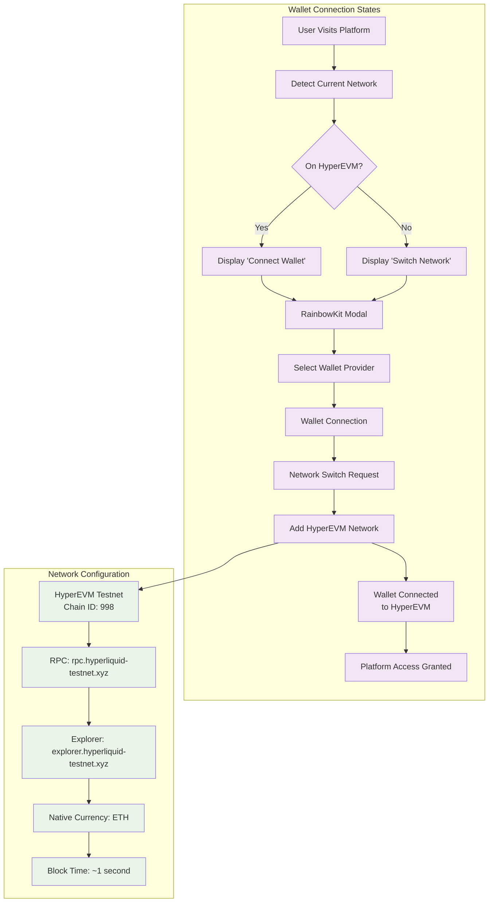
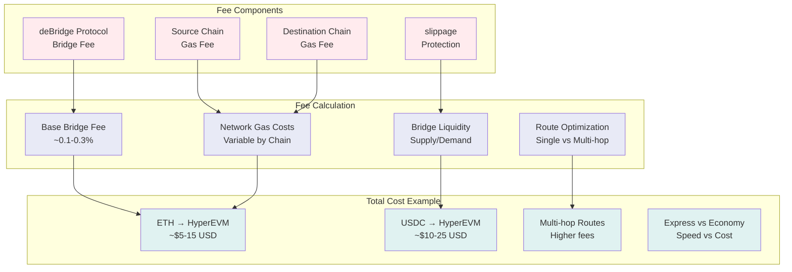
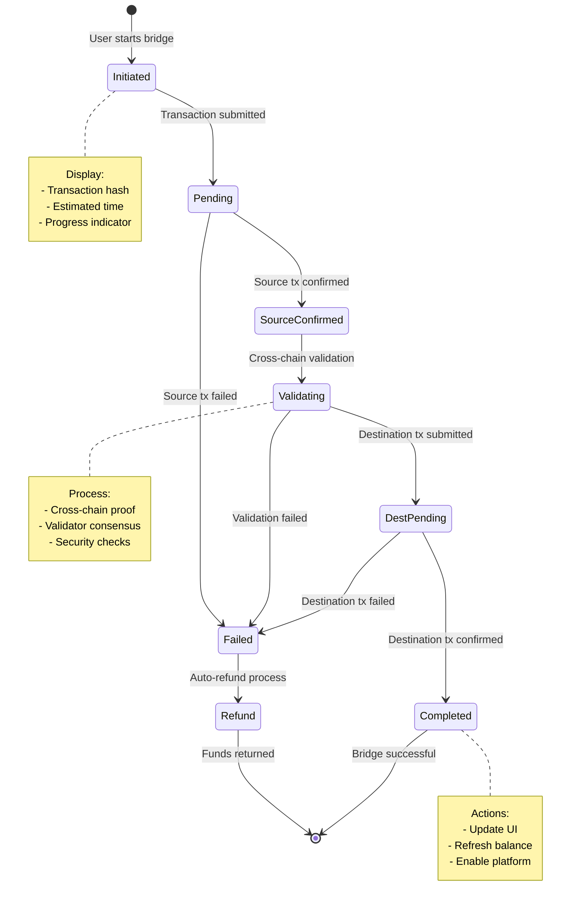

# Cross-Chain Onboarding Flow

## Complete Cross-Chain User Journey

```mermaid
graph TD
    subgraph "Source Chains"
        ETH[Ethereum Mainnet<br/>Chain ID: 1]
        ARB[Arbitrum One<br/>Chain ID: 42161]
        POLY[Polygon<br/>Chain ID: 137]
        BASE[Base<br/>Chain ID: 8453]
        OPT[Optimism<br/>Chain ID: 10]
        BSC[BSC<br/>Chain ID: 56]
        AVAX[Avalanche<br/>Chain ID: 43114]
    end

    subgraph "User Onboarding Journey"
        U1[User has Assets<br/>on Source Chain]
        U2[Discovers HyperMirror<br/>Copy Trading Platform]
        U3[Clicks 'Bridge to<br/>HyperEVM' Button]
        U4[deBridge Widget<br/>Opens]
        U5[Select Source Chain<br/>& Asset Amount]
        U6[Review Bridge Quote<br/>Fees & Time Estimate]
        U7[Approve Token<br/>Spending (if needed)]
        U8[Initiate Bridge<br/>Transaction]
        U9[Wait for Bridge<br/>Completion]
        U10[Connect Wallet to<br/>HyperEVM Network]
        U11[Start Copy Trading<br/>on HyperMirror]
    end

    subgraph "deBridge Integration"
        DLN[deBridge DLN Protocol]
        DLNAPI[deBridge API<br/>api.dln.trade/v1.0]
        WIDGET[deBridge Widget<br/>app.dln.trade]
        QUOTE[Bridge Quote<br/>Engine]
        VAL[Cross-Chain<br/>Validator Network]
        EXEC[Order Execution<br/>Engine]
    end

    subgraph "HyperEVM Destination"
        HNET[HyperEVM Network<br/>Chain ID: 998/999]
        HWALLET[User Wallet<br/>on HyperEVM]
        HBALANCE[ETH Balance<br/>on HyperEVM]
        HPLATFORM[HyperMirror<br/>Platform Access]
    end

    %% Source chain connections
    ETH --> U1
    ARB --> U1
    POLY --> U1
    BASE --> U1
    OPT --> U1
    BSC --> U1
    AVAX --> U1

    %% User journey flow
    U1 --> U2 --> U3 --> U4 --> U5 --> U6 --> U7 --> U8 --> U9 --> U10 --> U11

    %% deBridge integration
    U4 --> WIDGET
    U5 --> QUOTE
    U6 --> DLNAPI
    U8 --> DLN
    DLN --> VAL
    VAL --> EXEC
    EXEC --> HNET

    %% HyperEVM destination
    U9 --> HNET
    U10 --> HWALLET
    HWALLET --> HBALANCE
    U11 --> HPLATFORM

    %% Styling
    classDef sourceChain fill:#e3f2fd
    classDef userJourney fill:#f3e5f5
    classDef debridgeIntegration fill:#fff3e0
    classDef hyperevmDestination fill:#e8f5e8

    class ETH,ARB,POLY,BASE,OPT,BSC,AVAX sourceChain
    class U1,U2,U3,U4,U5,U6,U7,U8,U9,U10,U11 userJourney
    class DLN,DLNAPI,WIDGET,QUOTE,VAL,EXEC debridgeIntegration
    class HNET,HWALLET,HBALANCE,HPLATFORM hyperevmDestination
```

## Detailed Bridge Transaction Flow



## Asset Bridge Mapping



## Wallet Connection Flow



## Cross-Chain Fee Structure



## Bridge Status Monitoring



## Integration Points

### Frontend Integration
```typescript
// deBridge Widget Integration
const debridgeWidget = {
  chainId: 998, // HyperEVM Testnet
  targetChainId: 998,
  defaultInputToken: "0x0000000000000000000000000000000000000000", // ETH
  defaultOutputToken: "0x0000000000000000000000000000000000000000", // ETH
  theme: "dark",
  onOrderCreated: (order) => {
    // Track bridge transaction
    trackBridgeTransaction(order);
  },
  onOrderCompleted: (order) => {
    // Refresh user balance
    refreshBalance();
    // Show success notification
    showBridgeSuccess();
  }
};
```

### API Endpoints
- **Bridge Quote**: `/api/bridge/quote` - Get bridge cost estimate
- **Bridge Status**: `/api/bridge/status/:txHash` - Check bridge progress
- **Supported Chains**: `/api/bridge/chains` - List available source chains
- **Bridge History**: `/api/bridge/history/:address` - User bridge transactions

### Risk Considerations
1. **Bridge Delays**: Cross-chain transactions can take 2-30 minutes
2. **Failed Transactions**: Auto-refund mechanisms in place
3. **Slippage Protection**: Price impact limits during bridging
4. **MEV Protection**: Front-running prevention measures
5. **Emergency Stops**: Circuit breakers for unusual activity

### User Experience Optimizations
1. **Real-time Updates**: WebSocket notifications for bridge status
2. **Mobile Responsive**: Optimized widget for mobile devices
3. **One-Click Bridge**: Minimal steps for common routes
4. **Gas Estimation**: Accurate fee predictions before bridging
5. **Recovery Support**: Help desk for stuck transactions