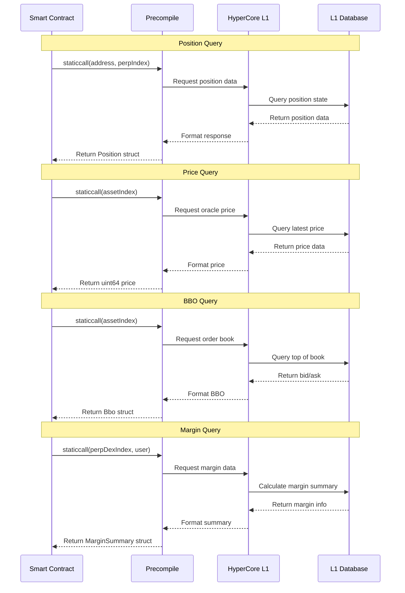
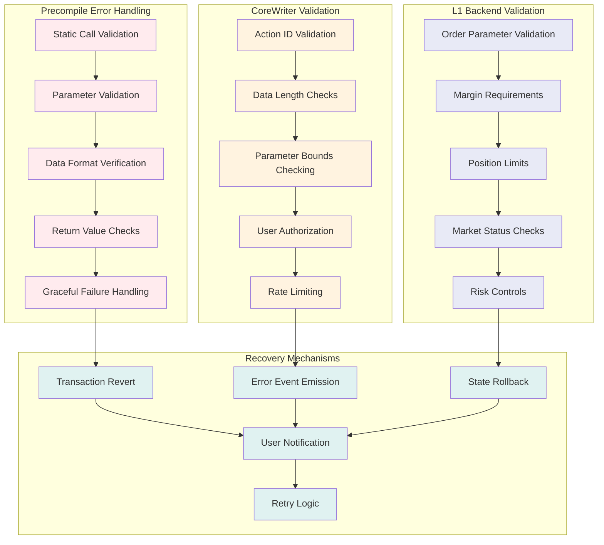
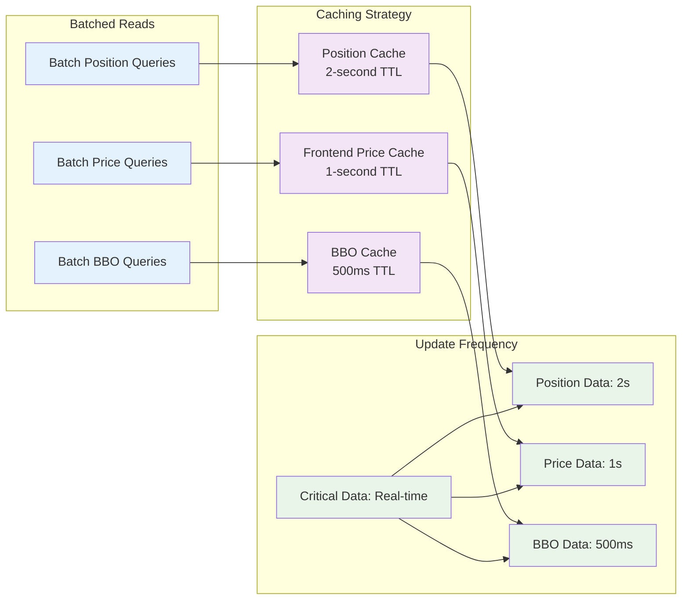

# HyperCore Integration Architecture

## HyperCore Precompile System Overview

```mermaid
graph TB
    subgraph "Smart Contract Layer"
        MAIN[HyperCoreCopyTrading.sol<br/>Main Contract]
        IFACES[Interface Contracts<br/>IL1Read.sol, ICoreWriter.sol]
    end

    subgraph "HyperCore Precompiles - EVM Native Access"
        P800[Position Precompile<br/>0x0800<br/>Get user positions]
        P801[Spot Balance Precompile<br/>0x0801<br/>Get spot balances]
        P802[Vault Equity Precompile<br/>0x0802<br/>Get vault equity]
        P803[Withdrawable Precompile<br/>0x0803<br/>Get withdrawable amount]
        P807[Oracle Price Precompile<br/>0x0807<br/>Get asset prices]
        P80E[BBO Precompile<br/>0x080e<br/>Get best bid/offer]
        P80F[Margin Summary Precompile<br/>0x080F<br/>Get margin summary]
    end

    subgraph "CoreWriter Gateway"
        CW[CoreWriter Contract<br/>0x3333333333333333333333333333333333333333]
        CWF[sendRawAction Function<br/>Gateway to L1]
    end

    subgraph "Action Encoding System"
        A1[Action ID 1<br/>Limit Order]
        A2[Action ID 2<br/>Vault Transfer]
        A7[Action ID 7<br/>USD Class Transfer]
        A10[Action ID 10<br/>Cancel by OID]
        A11[Action ID 11<br/>Cancel by CLOID]
    end

    subgraph "HyperCore L1 Backend"
        L1[HyperCore L1 Engine]
        ORD[Order Management]
        POS[Position Management]
        MARGIN[Margin Calculation]
        ORACLE[Price Oracle]
        SETTLE[Settlement Engine]
    end

    %% Connections from contract to precompiles
    MAIN --> P800
    MAIN --> P801
    MAIN --> P802
    MAIN --> P803
    MAIN --> P807
    MAIN --> P80E
    MAIN --> P80F

    %% CoreWriter connections
    MAIN --> CW
    CW --> CWF

    %% Action encoding
    MAIN --> A1
    MAIN --> A2
    MAIN --> A7
    MAIN --> A10
    MAIN --> A11

    %% L1 backend connections
    CWF --> L1
    P800 --> POS
    P801 --> POS
    P802 --> POS
    P803 --> POS
    P807 --> ORACLE
    P80E --> ORD
    P80F --> MARGIN

    L1 --> ORD
    L1 --> POS
    L1 --> MARGIN
    L1 --> ORACLE
    L1 --> SETTLE

    %% Styling
    classDef contractLayer fill:#e3f2fd
    classDef precompileLayer fill:#f3e5f5
    classDef corewriterLayer fill:#fff3e0
    classDef actionLayer fill:#e8f5e8
    classDef l1Layer fill:#fce4ec

    class MAIN,IFACES contractLayer
    class P800,P801,P802,P803,P807,P80E,P80F precompileLayer
    class CW,CWF corewriterLayer
    class A1,A2,A7,A10,A11 actionLayer
    class L1,ORD,POS,MARGIN,ORACLE,SETTLE l1Layer
```



## Precompile Function Details

### Position Precompile (0x0800)
```mermaid
graph LR
    subgraph "Position Data Structure"
        PDS[Position {<br/>szi: int64<br/>entryNtl: uint64<br/>isolatedRawUsd: int64<br/>leverage: uint32<br/>isIsolated: bool<br/>}]
    end

    subgraph "Function Call"
        FC[getTraderPosition(<br/>address trader,<br/>uint16 perpIndex<br/>)]
    end

    subgraph "Use Cases"
        UC1[Monitor Open Positions]
        UC2[Calculate PnL]
        UC3[Risk Management]
        UC4[Position Mirroring]
    end

    FC --> PDS
    PDS --> UC1
    PDS --> UC2
    PDS --> UC3
    PDS --> UC4

    classDef dataStruct fill:#e3f2fd
    classDef function fill:#f3e5f5
    classDef usecase fill:#e8f5e8

    class PDS dataStruct
    class FC function
    class UC1,UC2,UC3,UC4 usecase
```

### Oracle Price Precompile (0x0807)
```mermaid
graph LR
    subgraph "Price Feed"
        PF[getOraclePrice(<br/>uint32 assetIndex<br/>)<br/>Returns: uint64 price]
    end

    subgraph "Asset Mapping"
        AM[Asset Index Mapping<br/>0: BTC-USD<br/>1: ETH-USD<br/>2: SOL-USD<br/>3: ARB-USD<br/>...]
    end

    subgraph "Price Format"
        PFM[Price Format<br/>Decimal: price / 1e8<br/>Example: 5000000000000<br/>= $50,000.00]
    end

    subgraph "Applications"
        APP1[Real-time Price Display]
        APP2[PnL Calculation]
        APP3[Risk Assessment]
        APP4[Order Validation]
    end

    PF --> AM
    PF --> PFM
    PFM --> APP1
    PFM --> APP2
    PFM --> APP3
    PFM --> APP4

    classDef priceFunction fill:#fff3e0
    classDef mapping fill:#e8f5e8
    classDef format fill:#f3e5f5
    classDef application fill:#e3f2fd

    class PF priceFunction
    class AM mapping
    class PFM format
    class APP1,APP2,APP3,APP4 application
```

### Best Bid Offer Precompile (0x080e)
```mermaid
graph LR
    subgraph "BBO Structure"
        BBO[Bbo {<br/>bid: uint64<br/>ask: uint64<br/>}]
    end

    subgraph "Market Data"
        MD[getBestBidOffer(<br/>uint32 assetIndex<br/>)]
    end

    subgraph "Calculations"
        CALC[Spread = ask - bid<br/>SpreadPct = spread/bid * 100<br/>MidPrice = (bid + ask) / 2]
    end

    subgraph "Trading Logic"
        TL1[Order Price Validation]
        TL2[Slippage Protection]
        TL3[Market Impact Analysis]
        TL4[Liquidity Assessment]
    end

    MD --> BBO
    BBO --> CALC
    CALC --> TL1
    CALC --> TL2
    CALC --> TL3
    CALC --> TL4

    classDef structure fill:#e3f2fd
    classDef data fill:#f3e5f5
    classDef calculation fill:#fff3e0
    classDef logic fill:#e8f5e8

    class BBO structure
    class MD data
    class CALC calculation
    class TL1,TL2,TL3,TL4 logic
```

## CoreWriter Action System

```mermaid
graph TD
    subgraph "Action Encoding Process"
        AE1[Define Action Parameters]
        AE2[Encode with ABI]
        AE3[Create Action Header<br/>Version + Action ID]
        AE4[Combine Header + Data]
        AE5[Send to CoreWriter]
    end

    subgraph "Action Types & IDs"
        AT1[ID 1: Limit Order<br/>asset, isBuy, limitPx, sz, reduceOnly, tif, cloid]
        AT2[ID 2: Vault Transfer<br/>vault, isDeposit, usd]
        AT7[ID 7: USD Class Transfer<br/>amount, destination]
        AT10[ID 10: Cancel by OID<br/>asset, oid]
        AT11[ID 11: Cancel by CLOID<br/>asset, cloid]
    end

    subgraph "Data Format"
        DF[bytes data = new bytes(4 + encodedAction.length)<br/>data[0] = 0x01 // Version<br/>data[1] = 0x00<br/>data[2] = 0x00<br/>data[3] = ACTION_ID<br/>data[4+] = encodedAction]
    end

    subgraph "CoreWriter Execution"
        CWE[CoreWriter.sendRawAction(data)<br/>↓<br/>HyperCore L1 Processing<br/>↓<br/>Order/Action Execution]
    end

    AE1 --> AE2 --> AE3 --> AE4 --> AE5
    AE1 --> AT1
    AE1 --> AT2
    AE1 --> AT7
    AE1 --> AT10
    AE1 --> AT11
    AE4 --> DF
    AE5 --> CWE

    classDef encoding fill:#e3f2fd
    classDef actionType fill:#f3e5f5
    classDef dataFormat fill:#fff3e0
    classDef execution fill:#e8f5e8

    class AE1,AE2,AE3,AE4,AE5 encoding
    class AT1,AT2,AT7,AT10,AT11 actionType
    class DF dataFormat
    class CWE execution
```

## L1 Read Operations Flow



## Error Handling and Validation



## Performance Optimization

### Precompile Access Patterns


## Integration Examples

### Frontend Hook Implementation
```typescript
// useHyperCorePosition hook
const useHyperCorePosition = (address: string, perpIndex: number) => {
  return useContractRead({
    address: '0x0000000000000000000000000000000000000800',
    abi: positionPrecompileABI,
    functionName: 'position',
    args: [address, perpIndex],
    enabled: !!address,
    watch: true, // Real-time updates
  });
};

// useOraclePrice hook with auto-refresh
const useOraclePrice = (assetIndex: number) => {
  const { data, refetch } = useContractRead({
    address: '0x0000000000000000000000000000000000000807',
    abi: oraclePriceABI,
    functionName: 'oraclePx',
    args: [assetIndex],
  });

  useEffect(() => {
    const interval = setInterval(refetch, 1000);
    return () => clearInterval(interval);
  }, [refetch]);

  return { price: data ? Number(data) / 1e8 : 0 };
};
```

### Contract Integration Patterns
```solidity
// Efficient position reading
function getTraderPosition(address _trader, uint16 _perp)
    external view returns (IL1Read.Position memory) {
    (bool success, bytes memory result) = POSITION_PRECOMPILE.staticcall(
        abi.encode(_trader, _perp)
    );
    require(success, "Failed to get position");
    return abi.decode(result, (IL1Read.Position));
}

// Batch order placement with error handling
function placeLimitOrderWithValidation(
    uint32 _asset,
    bool _isBuy,
    uint64 _limitPx,
    uint64 _sz
) external returns (uint128) {
    // Validate against current BBO
    IL1Read.Bbo memory bbo = getBestBidOffer(_asset);
    require(_isBuy ? _limitPx <= bbo.ask : _limitPx >= bbo.bid,
            "Price outside market");

    // Place order
    return placeLimitOrder(_asset, _isBuy, _limitPx, _sz, false, 2);
}
```

This comprehensive integration architecture ensures seamless communication between the smart contract layer and HyperCore's powerful L1 infrastructure while maintaining high performance and reliability.